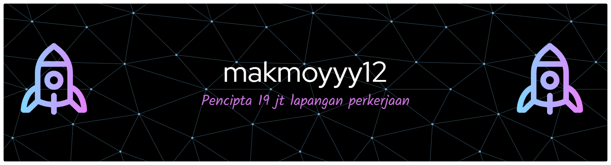

<h1 align="center">Halo, Saya Arialdi Manday</h1>

  🎓 Mahasiswa 2024 <b>Fasilkom-TI, Universitas Sumatera Utara</b> 
  🚀 Sedang berkembang di bidang Web Development & Data

---

## 👨‍💻 Tentang Saya

- 🎓 Mahasiswa aktif di **Fasilkom-TI USU**
- 🌱 Sedang belajar **Pengembangan Web, Basis Data, dan Algoritma**
- 💡 Tertarik pada UI/UX, Backend Development, dan Pengolahan Data
- 🎯 Target: Menjadi Software Engineer profesional

---

## 🛠️ Tech Stack

  

---

## 📊 Game PacMan

  <picture>
    <source media="(prefers-color-scheme: dark)" srcset="https://raw.githubusercontent.com/Arialdi123/Arialdi123/output/pacman-contribution-graph-dark.svg">
    <source media="(prefers-color-scheme: light)" srcset="https://raw.githubusercontent.com/Arialdi123/Arialdi123/output/pacman-contribution-graph.svg">
    
  </picture>

---
### My GitHub Stats:

  

  
   

## �📫 Sosial Media

  

---

  ✨ “tugas kami hanya menjadi orang baik, bukan terlihat seperti orang.” ✨

  ✨ “sebaik baik manusia adalah manusia yang bermanfaat bagi orang baik” ✨

